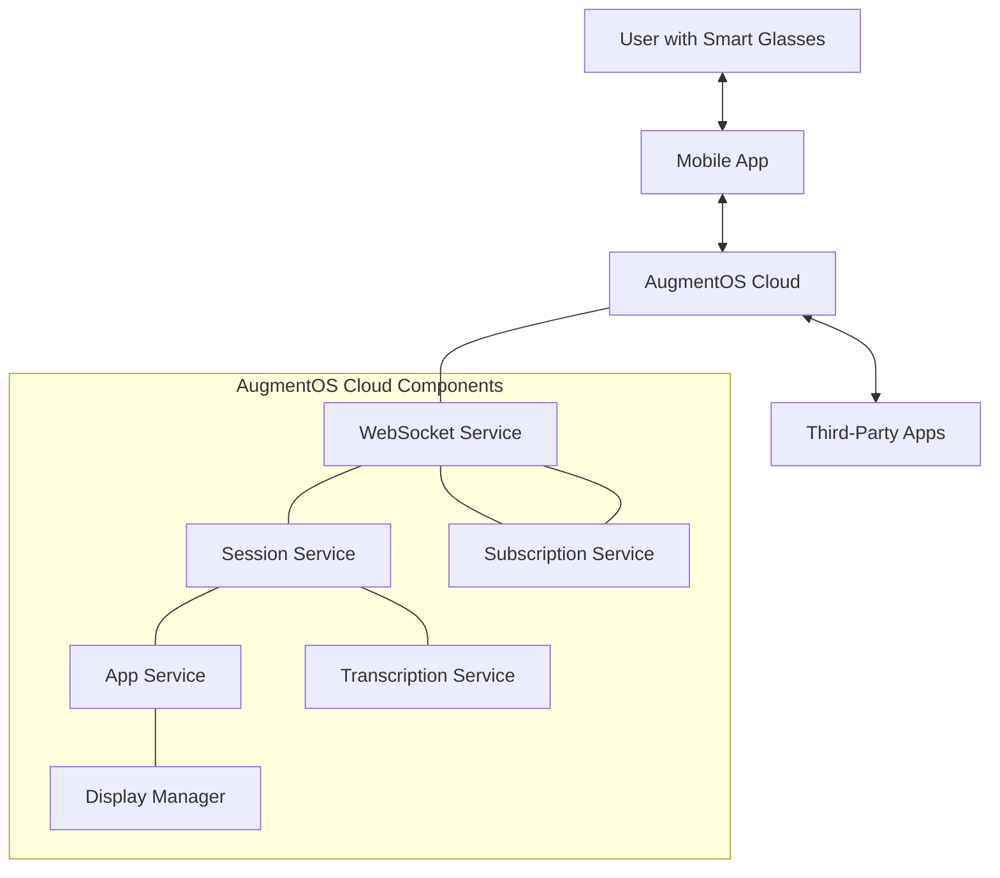

# AugmentOS Cloud System Documentation

**Author:** Isaiah Ballah (github: isaiahb)  
**Date:** March 25, 2025  
**Version:** 2.0  

## Introduction

This documentation provides a comprehensive overview of the AugmentOS Cloud system, a cloud-based operating system for smart glasses that enables third-party applications to deliver augmented reality experiences. The system facilitates real-time communication between smart glasses, mobile devices, and cloud services, creating a powerful platform for AR applications.

## Documentation Organization

This documentation is organized into the following sections:

1. **System Architecture** - Overview of the entire system's architecture, components, and communication flows
2. **TPA Session Management** - Detailed design for improved TPA (Third-Party Application) session management
3. **Type System Design** - Comprehensive type system improvements for better developer experience
4. **TPA SDK Enhancements** - Design for improved TPA SDK reliability, performance, and developer experience

## Key Concepts

### Smart Glasses Integration

AugmentOS Cloud connects to smart glasses via a mobile phone application, enabling real-time communication for:
- Audio processing and transcription
- Sensor data collection (head position, button presses)
- Display rendering in the glasses field of view
- Application lifecycle management

### Third-Party Applications (TPAs)

Third-party applications extend the system's functionality by:
- Processing user input (voice, buttons, head movements)
- Displaying content on the glasses
- Integrating with external services and APIs
- Providing specialized functionality (e.g., translations, notifications)

### WebSocket Communication

The system uses WebSocket connections for real-time bidirectional communication:
- Glasses clients connect to `/glasses-ws` endpoint
- TPAs connect to `/tpa-ws` endpoint
- Binary data for audio streams
- JSON messages for control and event data

### Session Management

The system manages user sessions to maintain state:
- User authentication via JWT tokens
- Session persistence across reconnections
- TPA connection management
- Resource allocation and cleanup

## System Component Overview

## Key Features

### Real-time Audio Processing

- Low-latency audio streaming from glasses
- Speech-to-text transcription
- Multi-language support
- Voice activity detection (VAD)

### Display Management

- Layout system for content presentation
- Display prioritization
- Multiple view support (main, dashboard)
- Efficient rendering pipeline

### Third-Party Application Framework

- WebSocket-based communication
- Event subscription model
- Display request system
- Session management

### Resilience and Recovery

- Connection health monitoring
- Automatic reconnection
- Session state preservation
- Error handling and recovery

## Development Resources

The following resources are available for developers:

1. **TPA SDK** - Software Development Kit for creating Third-Party Applications
2. **API Reference** - Detailed documentation of available APIs
3. **Code Examples** - Sample applications demonstrating key features
4. **Development Tools** - Utilities for testing and debugging TPAs

## Design Principles

The system is built on the following design principles:

1. **Reliability** - Stable operation with automatic recovery from failures
2. **Performance** - Low-latency processing for real-time AR experiences
3. **Security** - Strong authentication and data protection
4. **Extensibility** - Easy integration of new features and applications
5. **Developer Experience** - Clear APIs and comprehensive documentation

## Getting Started

For new developers, we recommend:

1. Review the System Architecture document to understand the overall system
2. Explore the TPA SDK documentation to learn how to create applications
3. Study the sample applications for practical examples
4. Join the developer community for support and collaboration

## Document Updates

This documentation will be updated regularly to reflect system changes and improvements. See each individual document for its specific version history.

## Support

For questions, feedback, or support, contact the AugmentOS development team at support@augmentos.org or join our Discord community.