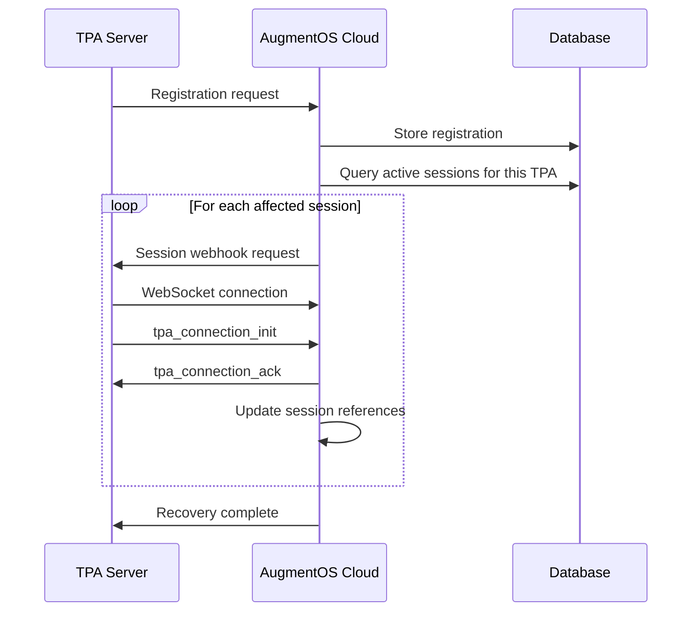

# TPA Session Management Design

**Author:** Isaiah Ballah (github: isaiahb)  
**Date:** March 25, 2025  
**Version:** 2.0  

## 1. Introduction

This document outlines the design for improved TPA (Third-Party Application) session management in AugmentOS Cloud. The goal is to enhance reliability, resilience, and user experience by addressing issues related to session disconnections, TPA server restarts, and error handling.

## 2. Current Implementation Analysis

### 2.1 Session Management Flow

The current implementation handles connections as follows:

1. **User Session Initialization**:
   - User connects via WebSocket to `/glasses-ws`
   - Cloud creates a `UserSession` object
   - Cloud starts TPAs via webhook
   - TPAs connect to cloud via WebSocket to `/tpa-ws`
   - Cloud stores TPA connections in `userSession.appConnections`

2. **User Reconnection**:
   - New session is created with new sessionId
   - `handleReconnectUserSession` transfers properties from old to new session
   - TPA WebSocket references are transferred as-is
   - No validation of TPA connections during transfer

3. **TPA Server Restart**:
   - No notification mechanism to cloud
   - No registration process for TPAs
   - Existing WebSocket references become invalid
   - No auto-recovery of TPA connections

### 2.2 Identified Issues

1. **Stale Connections**:
   - When users reconnect, transferred TPA connections may be invalid
   - No validation of connection health during transfer
   - No notification to TPAs about user reconnection

2. **TPA Server Restart Handling**:
   - When TPA servers restart, existing WebSocket references in sessions become invalid
   - No recovery mechanism for affected sessions
   - Users must manually restart apps on their glasses

3. **Error Recovery**:
   - Limited error handling in TPA connections
   - No heartbeat mechanism to detect dead connections
   - Single errors can cascade into permanent disconnections

4. **Configuration Issues**:
   - Some TPAs hardcode WebSocket URLs instead of using webhook-provided URLs
   - Limited automatic reconnection attempts in SDK

## 3. Proposed Improvements

### 3.1 TPA Server Registration System

Create a mechanism for TPAs to register with the cloud when they start.

#### API Design

```typescript
// Registration request
interface TpaRegistrationRequest {
  packageName: string;     // TPA identifier
  apiKey: string;          // Authentication
  serverUrl: string;       // TPA server address
  version: string;         // TPA version
  capabilities?: string[]; // Optional TPA capabilities
}

// Registration response
interface TpaRegistrationResponse {
  success: boolean;
  registrationId?: string;
  activeSessions?: number; // Count of active sessions
}
```

#### Implementation Details

1. **Registration Endpoint**:
   - Add `/api/tpa/register` endpoint to cloud
   - Validate API key and package name
   - Store registration information in database
   - Return registration ID to TPA

2. **TPA SDK Updates**:
   - Add automatic registration on TPA server start
   - Include server version and capabilities
   - Implement periodic registration refresh

3. **Cloud Registry Storage**:
   - Create TPA registry in database
   - Track latest registration details
   - Maintain history of server restarts

### 3.2 Connection Health Management

Implement mechanisms to detect and recover from connection issues.

#### WebSocket Heartbeat

```typescript
// Heartbeat message
interface HeartbeatMessage {
  type: 'heartbeat';
  timestamp: Date;
  sessionId: string;
}

// Heartbeat response
interface HeartbeatResponse {
  type: 'heartbeat_ack';
  timestamp: Date;
  sessionId: string;
  stats?: ConnectionStats;
}
```

#### Implementation Details

1. **Heartbeat Protocol**:
   - Implement application-level heartbeat messages
   - Configure heartbeat interval (default: 30s)
   - Track missed heartbeats (consider dead after 3 misses)

2. **Connection State Tracking**:
   - Track last activity timestamp
   - Monitor WebSocket readyState
   - Collect connection performance metrics

3. **Proactive Health Checks**:
   - Periodically validate connection health
   - Trigger recovery for unhealthy connections
   - Log connection health metrics

### 3.3 Enhanced Session Reconnection

Improve how user reconnections are handled.

#### User Session Transfer

```typescript
async function handleUserReconnection(oldSession, newSession) {
  // Transfer basic session properties
  newSession.activeAppSessions = oldSession.activeAppSessions;
  newSession.transcript = oldSession.transcript;
  newSession.OSSettings = oldSession.OSSettings;
  
  // Instead of directly transferring WebSocket references
  // Transfer connection metadata and validate/reconnect
  await validateAndTransferTpaConnections(oldSession, newSession);
  
  // Update session ID in database
  await updateSessionIdReferences(oldSession.sessionId, newSession.sessionId);
  
  // Close old session resources
  closeOldSessionResources(oldSession);
}
```

#### Implementation Details

1. **Connection Validation**:
   - Before transferring TPA connections, validate they're still active
   - Check WebSocket readyState and last activity
   - Use heartbeat to confirm connection health

2. **TPA Notification**:
   - Send user_reconnected event to TPAs when a user reconnects
   - Include new session information
   - Allow TPAs to update their internal state

3. **Connection Recovery**:
   - For invalid connections, trigger recovery workflow
   - Use stored webhook URLs to re-establish connections
   - Restore subscription state after reconnection

### 3.4 TPA Server Restart Recovery

Implement mechanisms to recover from TPA server restarts.

#### Recovery Workflow



#### Implementation Details

1. **Active Session Discovery**:
   - On TPA registration, query for active sessions using this TPA
   - Create list of sessions that need reconnection
   - Prioritize reconnection based on session activity

2. **Session Recovery**:
   - For each affected session, trigger webhook
   - Pass session context in webhook payload
   - Restore previous subscription state
   - Update session references in database

3. **Notification System**:
   - Notify affected users of TPA reconnection
   - Optional display notification on glasses
   - Track success rate of recovery attempts

### 3.5 Improved Error Handling

Enhance error management throughout the system.

#### Error Handling Strategy

```typescript
// In TPA WebSocket message processing
try {
  const message = JSON.parse(data.toString());
  await this.processMessage(message);
} catch (error) {
  // Categorize error
  if (isConnectionError(error)) {
    await this.handleConnectionError(error);
  } else if (isMessageFormatError(error)) {
    this.logError('Message format error', error);
    // Continue processing other messages
  } else if (isInternalError(error)) {
    await this.handleInternalError(error);
  } else {
    // Uncategorized error
    this.logError('Unhandled error in message processing', error);
    // Implement graceful degradation
  }
}
```

#### Implementation Details

1. **Error Categorization**:
   - Classify errors by type and severity
   - Connection errors: Network issues, timeouts
   - Format errors: Malformed messages, incorrect types
   - Internal errors: Business logic failures
   - System errors: Resource limitations, crashes

2. **Recovery Strategies**:
   - Connection errors: Automatic reconnection with exponential backoff
   - Format errors: Log and continue, request resend if critical
   - Internal errors: Isolated recovery without affecting other components
   - System errors: Graceful degradation, administrator alerts

3. **Error Logging and Monitoring**:
   - Enhanced error context in logs
   - Correlation IDs for tracking errors across components
   - Automatic error aggregation and alerting

## 4. Dynamic Configuration

Ensure TPAs use dynamic WebSocket URLs and settings.

#### Configuration System

```typescript
interface TpaConfiguration {
  websocketUrl: string;
  heartbeatInterval: number;
  reconnectAttempts: number;
  reconnectBaseDelay: number;
  maxReconnectDelay: number;
}

// SDK configuration loading
function loadTpaConfiguration(webhookData) {
  // Priority order:
  // 1. Webhook-provided configuration
  // 2. Environment variables
  // 3. Default values
  return {
    websocketUrl: webhookData.augmentOSWebsocketUrl || 
                  process.env.AUGMENTOS_WEBSOCKET_URL ||
                  "wss://api.augmentos.org/tpa-ws",
    heartbeatInterval: parseInt(process.env.HEARTBEAT_INTERVAL || "30000"),
    reconnectAttempts: parseInt(process.env.RECONNECT_ATTEMPTS || "10"),
    reconnectBaseDelay: parseInt(process.env.RECONNECT_BASE_DELAY || "1000"),
    maxReconnectDelay: parseInt(process.env.MAX_RECONNECT_DELAY || "30000")
  };
}
```

#### Implementation Details

1. **SDK Enhancements**:
   - Prioritize webhook-provided URLs
   - Add configuration validation
   - Clear documentation of configuration hierarchy

2. **Environment-Based Configuration**:
   - Support for environment variables
   - Configuration file support
   - Docker environment integration

3. **Cloud-Provided Configuration**:
   - Include optimal settings in webhook payload
   - Environment-specific configurations (dev, staging, prod)
   - Dynamic adjustment based on system load

## 5. Implementation Plan

### 5.1 Phase 1: Critical Fixes (2 weeks)

1. **Enhance SDK Connection Logic**:
   - Improve TPA reconnection logic
   - Update documentation for webhook URL usage
   - Add better error handling in message processing

2. **Connection Validation**:
   - Add validation in `handleReconnectUserSession`
   - Remove invalid connections during transfer
   - Add proper error logging for connection issues

3. **Basic Heartbeat Mechanism**:
   - Implement application-level heartbeat
   - Track connection health based on heartbeat
   - Add timeout detection and logging

### 5.2 Phase 2: Registration System (3 weeks)

1. **TPA Registration API**:
   - Implement registration endpoint
   - Create database schema for TPA registry
   - Add authentication for registration API

2. **SDK Registration Client**:
   - Automatic registration on TPA server start
   - Registration refresh mechanism
   - Connection recovery helpers

3. **Active Session Discovery**:
   - Query mechanism for active sessions
   - Session recovery workflow
   - Connection restoration logic

### 5.3 Phase 3: Enhanced Resilience (3 weeks)

1. **Complete Reconnection Flow**:
   - TPA notification on user reconnection
   - Session recovery orchestration
   - Connection metadata transfer

2. **Advanced Error Handling**:
   - Error categorization system
   - Recovery strategies by error type
   - Error monitoring and aggregation

3. **Dynamic Configuration**:
   - Environment-based configuration
   - Cloud-provided optimal settings
   - Configuration validation and fallbacks

### 5.4 Phase 4: Testing and Optimization (2 weeks)

1. **Comprehensive Testing**:
   - Unit tests for new components
   - Integration tests for recovery workflows
   - Chaos testing for resilience verification

2. **Performance Optimization**:
   - Review and optimize reconnection timing
   - Minimize overhead of heartbeats
   - Benchmark session recovery time

3. **Documentation and Examples**:
   - Update developer documentation
   - Create example implementations
   - Provide migration guides

## 6. Success Metrics

### 6.1 Technical Metrics

1. **Recovery Success Rate**:
   - % of sessions successfully recovered after disconnections
   - % of TPAs successfully recovered after server restart
   - % of errors successfully handled without user impact

2. **Performance Metrics**:
   - Reconnection time < 2s (95th percentile)
   - Heartbeat overhead < 1% of bandwidth
   - Registration time < 1s

3. **Reliability Metrics**:
   - Reduction in manual app restarts needed
   - Increase in TPA uptime
   - Decrease in session-related errors

### 6.2 User Experience Metrics

1. **Session Continuity**:
   - Reduction in visible disconnections
   - Preservation of user context across reconnections
   - Seamless recovery from network issues

2. **Error Visibility**:
   - Reduction in user-visible error messages
   - Clear feedback when recovery is in progress
   - Appropriate notification for unrecoverable errors

## 7. Risks and Mitigations

| Risk | Description | Mitigation |
|------|-------------|------------|
| Increased System Complexity | New components and protocols add complexity | Thorough documentation, isolate components, robust testing |
| Performance Impact | Heartbeats and validation add overhead | Configurable intervals, optimized protocols, benchmark testing |
| Backward Compatibility | Changes may break existing TPAs | Maintain compatibility layer, gradual migration, clear documentation |
| Race Conditions | Concurrent reconnections may cause issues | Careful locking, idempotent operations, comprehensive testing |
| Security Implications | New endpoints could increase attack surface | Proper authentication, rate limiting, input validation |

## 8. Conclusion

The proposed improvements to TPA session management will significantly enhance the reliability and resilience of the AugmentOS Cloud platform. By implementing a robust registration system, connection health monitoring, enhanced reconnection logic, and improved error handling, we can minimize disruptions to users while providing a more stable platform for TPA developers.

These changes will require careful coordination across multiple components and phased implementation to minimize disruption. The long-term benefits, however, will be substantial: improved user experience, reduced support burden, and greater platform stability.