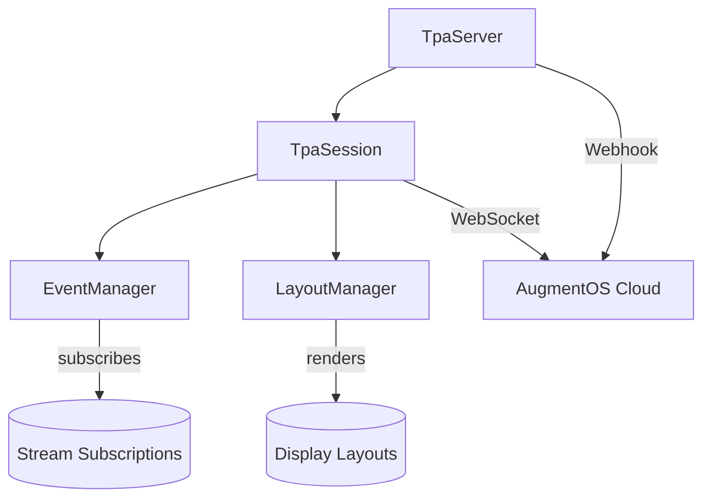

# TPA SDK Enhancements

**Author:** Isaiah Ballah (github: isaiahb)  
**Date:** March 25, 2025  
**Version:** 2.0  

## 1. Introduction

This document outlines proposed enhancements to the Third-Party Application (TPA) SDK that improve reliability, developer experience, and performance. The focus is on modernizing the SDK architecture, improving error handling, and implementing features that support robust session management.

## 2. Current SDK Analysis

### 2.1 Existing Architecture

The current TPA SDK consists of several key components:



1. **TpaSession**:
   - Manages WebSocket connection to cloud
   - Handles reconnection logic
   - Processes incoming messages

2. **EventManager**:
   - Manages event subscriptions
   - Routes events to handlers
   - Handles pub/sub model

3. **LayoutManager**:
   - Formats display requests
   - Manages display state
   - Handles layout variants

4. **TpaServer**:
   - Handles webhook requests
   - Manages TPA lifecycle
   - Creates TpaSession instances

### 2.2 Limitations

1. **Reliability Issues**:
   - Limited reconnection capabilities (max 5 attempts by default)
   - No heartbeat mechanism for connection health
   - Insufficient error recovery mechanisms
   - Webhook handling doesn't recover from server restarts

2. **Developer Experience**:
   - String-based type system without proper enums
   - Limited error information and context
   - Incomplete TypeScript type definitions
   - Lacking debugging and diagnostic tools

3. **Performance Concerns**:
   - No batching of messages
   - Inefficient event processing
   - Limited connection pooling
   - No prioritization of critical messages

## 3. Proposed Enhancements

### 3.1 Resilient Connection Management

#### 3.1.1 Enhanced WebSocket Wrapper

Create a resilient WebSocket wrapper with improved error handling and reconnection:

```typescript
export class ResilientWebSocket {
  private ws: WebSocket | null = null;
  private reconnectAttempts = 0;
  private reconnectTimer: NodeJS.Timeout | null = null;
  private heartbeatTimer: NodeJS.Timeout | null = null;
  private messageQueue: QueuedMessage[] = [];
  private lastPingTime?: number;
  private lastPongTime?: number;
  
  constructor(
    private url: string,
    private options: WebSocketOptions = {}
  ) {
    this.options = {
      autoReconnect: true,
      maxReconnectAttempts: 10,
      reconnectBaseDelay: 1000,
      maxReconnectDelay: 30000,
      heartbeatInterval: 30000,
      heartbeatTimeout: 10000,
      ...options
    };
  }
  
  public connect(): Promise<void> {
    return new Promise((resolve, reject) => {
      try {
        this.ws = new WebSocket(this.url);
        
        this.ws.onopen = () => {
          this.reconnectAttempts = 0;
          this.flushQueue();
          this.startHeartbeat();
          resolve();
        };
        
        this.ws.onclose = (event) => {
          this.handleDisconnection(event);
        };
        
        this.ws.onerror = (error) => {
          this.emit('error', new ConnectionError('WebSocket error', { cause: error }));
          if (!this.ws || this.ws.readyState >= 2) { // CLOSING or CLOSED
            reject(new ConnectionError('Failed to connect', { cause: error }));
          }
        };
        
        this.ws.onmessage = (event) => {
          try {
            if (event.data === 'pong') {
              this.lastPongTime = Date.now();
              return;
            }
            
            const data = typeof event.data === 'string' 
              ? JSON.parse(event.data) 
              : event.data;
              
            this.emit('message', data);
          } catch (error) {
            this.emit('error', new MessageParseError('Failed to parse message', { 
              cause: error,
              data: event.data
            }));
          }
        };
      } catch (error) {
        reject(new ConnectionError('Failed to create WebSocket', { cause: error }));
      }
    });
  }
  
  public send(data: any, priority = MessagePriority.NORMAL): void {
    const message = typeof data === 'string' ? data : JSON.stringify(data);
    
    if (!this.ws || this.ws.readyState !== WebSocket.OPEN) {
      this.queueMessage(message, priority);
      return;
    }
    
    try {
      this.ws.send(message);
    } catch (error) {
      this.emit('error', new SendError('Failed to send message', { 
        cause: error,
        data
      }));
      this.queueMessage(message, priority);
    }
  }
  
  private queueMessage(message: string, priority: MessagePriority): void {
    this.messageQueue.push({ message, priority, timestamp: Date.now() });
    this.messageQueue.sort((a, b) => b.priority - a.priority);
    
    // Cap queue size to prevent memory issues
    if (this.messageQueue.length > this.options.maxQueueSize) {
      this.messageQueue = this.messageQueue
        .slice(0, Math.floor(this.options.maxQueueSize * 0.8));
    }
  }
  
  private flushQueue(): void {
    if (!this.ws || this.ws.readyState !== WebSocket.OPEN) {
      return;
    }
    
    // Send queued messages, starting with highest priority
    while (this.messageQueue.length > 0) {
      const { message } = this.messageQueue.shift()!;
      try {
        this.ws.send(message);
      } catch (error) {
        this.emit('error', new SendError('Failed to send queued message', { cause: error }));
        break; // Stop trying if we hit an error
      }
    }
  }
  
  private startHeartbeat(): void {
    if (!this.options.heartbeatInterval) {
      return;
    }
    
    this.stopHeartbeat();
    
    this.heartbeatTimer = setInterval(() => {
      if (!this.ws || this.ws.readyState !== WebSocket.OPEN) {
        return;
      }
      
      this.lastPingTime = Date.now();
      try {
        this.ws.send('ping');
        
        // Check if we got a pong back for the previous ping
        if (this.lastPingTime && this.lastPongTime) {
          const timeSinceLastPong = this.lastPingTime - this.lastPongTime;
          if (timeSinceLastPong > this.options.heartbeatTimeout) {
            this.emit('warning', new HeartbeatTimeoutWarning(
              `No heartbeat response in ${timeSinceLastPong}ms`
            ));
            this.reconnect(); // Connection is stale, reconnect
          }
        }
      } catch (error) {
        this.emit('error', new HeartbeatError('Failed to send heartbeat', { cause: error }));
      }
    }, this.options.heartbeatInterval);
  }
  
  private stopHeartbeat(): void {
    if (this.heartbeatTimer) {
      clearInterval(this.heartbeatTimer);
      this.heartbeatTimer = null;
    }
  }
  
  private handleDisconnection(event: CloseEvent): void {
    this.stopHeartbeat();
    
    this.emit('disconnected', {
      code: event.code,
      reason: event.reason,
      wasClean: event.wasClean
    });
    
    if (!this.options.autoReconnect) {
      return;
    }
    
    if (this.reconnectAttempts >= this.options.maxReconnectAttempts) {
      this.emit('error', new MaxReconnectAttemptsError(
        `Exceeded maximum reconnection attempts (${this.options.maxReconnectAttempts})`
      ));
      return;
    }
    
    this.scheduleReconnect();
  }
  
  private scheduleReconnect(): void {
    if (this.reconnectTimer) {
      clearTimeout(this.reconnectTimer);
    }
    
    // Exponential backoff with jitter
    const delay = Math.min(
      this.options.reconnectBaseDelay * Math.pow(1.5, this.reconnectAttempts) * (0.9 + Math.random() * 0.2),
      this.options.maxReconnectDelay
    );
    
    this.reconnectAttempts++;
    
    this.emit('reconnecting', {
      attempt: this.reconnectAttempts,
      delay,
      maxAttempts: this.options.maxReconnectAttempts
    });
    
    this.reconnectTimer = setTimeout(() => {
      this.reconnect();
    }, delay);
  }
  
  private async reconnect(): Promise<void> {
    if (this.ws) {
      this.ws.onclose = null;
      this.ws.onerror = null;
      this.ws.onmessage = null;
      this.ws.onopen = null;
      
      try {
        this.ws.close();
      } catch (error) {
        // Ignore errors when closing
      }
      
      this.ws = null;
    }
    
    try {
      await this.connect();
      this.emit('reconnected', {
        attempt: this.reconnectAttempts
      });
    } catch (error) {
      this.emit('error', new ReconnectionError('Failed to reconnect', { cause: error }));
      this.scheduleReconnect();
    }
  }
  
  public close(code = 1000, reason = 'Normal closure'): void {
    this.stopHeartbeat();
    
    if (this.reconnectTimer) {
      clearTimeout(this.reconnectTimer);
      this.reconnectTimer = null;
    }
    
    if (this.ws) {
      try {
        this.ws.close(code, reason);
      } catch (error) {
        this.emit('error', new CloseError('Error closing connection', { cause: error }));
      }
    }
  }
  
  // Simple event emitter functionality
  private listeners: Record<string, Function[]> = {};
  
  public on(event: string, listener: Function): () => void {
    if (!this.listeners[event]) {
      this.listeners[event] = [];
    }
    
    this.listeners[event].push(listener);
    
    return () => {
      if (!this.listeners[event]) return;
      this.listeners[event] = this.listeners[event].filter(l => l !== listener);
    };
  }
  
  private emit(event: string, ...args: any[]): void {
    if (!this.listeners[event]) return;
    
    for (const listener of this.listeners[event]) {
      try {
        listener(...args);
      } catch (error) {
        console.error(`Error in ${event} listener:`, error);
      }
    }
  }
}
```

#### 3.1.2 Improved TpaSession Connection Logic

Enhance TpaSession to use the new resilient WebSocket:

```typescript
export class TpaSession {
  private connection: ResilientWebSocket;
  private connectionState: ConnectionState = ConnectionState.DISCONNECTED;
  private connectionPromise: Promise<void> | null = null;
  
  // ... other properties
  
  constructor(private config: TpaSessionConfig) {
    this.config = {
      augmentOSWebsocketUrl: 'wss://api.augmentos.org/tpa-ws',
      autoReconnect: true,
      maxReconnectAttempts: 10,
      reconnectDelay: 1000,
      ...config
    };
    
    // Initialize event manager and layout manager
    this.events = new EventManager(this.subscribe.bind(this));
    this.layouts = new LayoutManager(this.config.packageName, this.send.bind(this));
    
    // Create connection with enhanced options
    this.connection = new ResilientWebSocket(
      this.config.augmentOSWebsocketUrl,
      {
        autoReconnect: this.config.autoReconnect,
        maxReconnectAttempts: this.config.maxReconnectAttempts,
        reconnectBaseDelay: this.config.reconnectDelay,
        heartbeatInterval: 30000,
      }
    );
    
    // Set up connection event handlers
    this.setupConnectionEvents();
  }
  
  private setupConnectionEvents(): void {
    this.connection.on('message', (data) => {
      this.handleMessage(data);
    });
    
    this.connection.on('error', (error) => {
      this.events.emit('error', error);
    });
    
    this.connection.on('disconnected', (event) => {
      this.connectionState = ConnectionState.DISCONNECTED;
      this.events.emit('disconnected', 'Connection closed');
    });
    
    this.connection.on('reconnecting', (info) => {
      this.connectionState = ConnectionState.RECONNECTING;
      this.events.emit('reconnecting', info);
    });
    
    this.connection.on('reconnected', () => {
      this.connectionState = ConnectionState.CONNECTED;
      this.sendConnectionInit();
      this.events.emit('reconnected', {
        timestamp: new Date()
      });
    });
  }
  
  async connect(sessionId: string): Promise<void> {
    if (this.connectionState === ConnectionState.CONNECTED) {
      return;
    }
    
    if (this.connectionState === ConnectionState.CONNECTING && this.connectionPromise) {
      return this.connectionPromise;
    }
    
    this.sessionId = sessionId;
    this.connectionState = ConnectionState.CONNECTING;
    
    this.connectionPromise = new Promise<void>((resolve, reject) => {
      // Set up one-time event handlers for initial connection
      const onConnected = () => {
        this.events.off('connected', onConnected);
        this.events.off('error', onError);
        resolve();
      };
      
      const onError = (error: Error) => {
        this.events.off('connected', onConnected);
        this.events.off('error', onError);
        reject(error);
      };
      
      this.events.once('connected', onConnected);
      this.events.once('error', onError);
      
      // Connect and initialize
      this.connection.connect()
        .then(() => {
          this.sendConnectionInit();
        })
        .catch(error => {
          this.events.emit('error', error);
          reject(error);
        });
      
      // Connection timeout
      setTimeout(() => {
        if (this.connectionState !== ConnectionState.CONNECTED) {
          const error = new ConnectionTimeoutError('Connection timeout');
          this.events.emit('error', error);
          reject(error);
        }
      }, 10000);
    });
    
    return this.connectionPromise;
  }
  
  // ... other methods
}
```

### 3.2 Enhanced Error Handling

#### 3.2.1 Structured Error Classes

Create a hierarchy of error classes for better error handling:

```typescript
export class TpaError extends Error {
  constructor(
    message: string,
    public readonly options: {
      cause?: Error;
      data?: any;
      code?: string;
    } = {}
  ) {
    super(message);
    this.name = this.constructor.name;
    
    // Capture stack trace
    if (Error.captureStackTrace) {
      Error.captureStackTrace(this, this.constructor);
    }
  }
  
  public toJSON() {
    return {
      name: this.name,
      message: this.message,
      code: this.options.code,
      data: this.options.data,
      cause: this.options.cause instanceof Error 
        ? this.options.cause.message 
        : this.options.cause,
    };
  }
}

// Connection errors
export class ConnectionError extends TpaError {}
export class ConnectionTimeoutError extends ConnectionError {}
export class MaxReconnectAttemptsError extends ConnectionError {}
export class ReconnectionError extends ConnectionError {}
export class HeartbeatError extends ConnectionError {}
export class HeartbeatTimeoutWarning extends TpaError {}

// Message errors
export class MessageError extends TpaError {}
export class MessageParseError extends MessageError {}
export class SendError extends MessageError {}
export class UnhandledMessageTypeError extends MessageError {}

// Protocol errors
export class ProtocolError extends TpaError {}
export class AuthenticationError extends ProtocolError {}
export class SubscriptionError extends ProtocolError {}
export class DisplayError extends ProtocolError {}
```

#### 3.2.2 Error Context Enhancement

Improve error reporting by including context:

```typescript
export class ErrorReporter {
  private static instance: ErrorReporter;
  
  private constructor(
    private options: {
      onError?: (error: TpaError) => void;
      captureContext?: boolean;
    } = {}
  ) {}
  
  public static getInstance(): ErrorReporter {
    if (!ErrorReporter.instance) {
      ErrorReporter.instance = new ErrorReporter();
    }
    return ErrorReporter.instance;
  }
  
  public static configure(options: {
    onError?: (error: TpaError) => void;
    captureContext?: boolean;
  }): void {
    const instance = ErrorReporter.getInstance();
    instance.options = {
      ...instance.options,
      ...options
    };
  }
  
  public report(error: TpaError, context?: Record<string, any>): void {
    // Enhance error with context
    if (context) {
      error.options.data = {
        ...error.options.data,
        context
      };
    }
    
    // Call custom error handler if provided
    if (this.options.onError) {
      try {
        this.options.onError(error);
      } catch (handlerError) {
        console.error('Error in custom error handler:', handlerError);
      }
    }
    
    // Always log to console
    console.error(error);
  }
  
  public captureAndReport<T>(
    fn: () => T,
    errorType: new (message: string, options?: any) => TpaError = TpaError,
    context?: Record<string, any>
  ): T {
    try {
      return fn();
    } catch (cause) {
      const error = new errorType('Error in operation', { cause });
      this.report(error, context);
      throw error;
    }
  }
  
  public async captureAndReportAsync<T>(
    fn: () => Promise<T>,
    errorType: new (message: string, options?: any) => TpaError = TpaError,
    context?: Record<string, any>
  ): Promise<T> {
    try {
      return await fn();
    } catch (cause) {
      const error = new errorType('Error in async operation', { cause });
      this.report(error, context);
      throw error;
    }
  }
}
```

### 3.3 TPA Server Enhancements

#### 3.3.1 Server Registration System

```typescript
export interface RegistrationOptions {
  packageName: string;
  apiKey: string;
  serverUrl: string;
  capabilities?: string[];
  version?: string;
}

export class TpaRegistrationClient {
  private registrationId?: string;
  private refreshTimer?: NodeJS.Timeout;
  
  constructor(
    private options: {
      registrationEndpoint: string;
      refreshInterval?: number;
      onRegistrationSuccess?: (id: string) => void;
      onRegistrationError?: (error: Error) => void;
    }
  ) {
    this.options = {
      refreshInterval: 5 * 60 * 1000, // 5 minutes
      ...options
    };
  }
  
  public async register(registration: RegistrationOptions): Promise<string> {
    try {
      const response = await fetch(this.options.registrationEndpoint, {
        method: 'POST',
        headers: {
          'Content-Type': 'application/json'
        },
        body: JSON.stringify(registration)
      });
      
      if (!response.ok) {
        const errorText = await response.text();
        throw new RegistrationError(`Registration failed: ${response.status} ${errorText}`);
      }
      
      const data = await response.json();
      
      if (!data.success) {
        throw new RegistrationError(`Registration failed: ${data.message}`);
      }
      
      this.registrationId = data.registrationId;
      
      // Start refresh timer
      this.startRefreshTimer(registration);
      
      if (this.options.onRegistrationSuccess) {
        this.options.onRegistrationSuccess(this.registrationId);
      }
      
      return this.registrationId;
    } catch (error) {
      const registrationError = error instanceof RegistrationError
        ? error
        : new RegistrationError('Registration failed', { cause: error });
      
      if (this.options.onRegistrationError) {
        this.options.onRegistrationError(registrationError);
      }
      
      throw registrationError;
    }
  }
  
  private startRefreshTimer(registration: RegistrationOptions): void {
    if (this.refreshTimer) {
      clearTimeout(this.refreshTimer);
    }
    
    this.refreshTimer = setTimeout(async () => {
      try {
        await this.register(registration);
      } catch (error) {
        console.error('Error refreshing registration:', error);
        
        // Try again after a shorter interval
        setTimeout(() => {
          this.startRefreshTimer(registration);
        }, 60 * 1000);
      }
    }, this.options.refreshInterval);
  }
  
  public stop(): void {
    if (this.refreshTimer) {
      clearTimeout(this.refreshTimer);
      this.refreshTimer = undefined;
    }
  }
}
```

#### 3.3.2 Enhanced TpaServer

Update the TpaServer class to include registration and better session management:

```typescript
export class TpaServer {
  private app: Express;
  private activeSessions = new Map<string, TpaSession>();
  private cleanupHandlers: Array<() => void> = [];
  private registrationClient?: TpaRegistrationClient;
  
  constructor(private config: TpaServerConfig) {
    this.config = {
      port: 7010,
      webhookPath: '/webhook',
      publicDir: false,
      healthCheck: true,
      sessionRecovery: true,
      registration: true,
      ...config
    };
    
    // Initialize Express app
    this.app = express();
    this.app.use(express.json());
    
    // Setup server features
    this.setupWebhook();
    this.setupHealthCheck();
    this.setupPublicDir();
    this.setupShutdown();
    
    // Setup TPA registration if enabled
    if (this.config.registration) {
      this.setupRegistration();
    }
  }
  
  private setupRegistration(): void {
    const endpoint = this.config.registrationEndpoint || 'https://api.augmentos.org/api/tpa/register';
    
    this.registrationClient = new TpaRegistrationClient({
      registrationEndpoint: endpoint,
      onRegistrationSuccess: (id) => {
        console.log(`🎯 TPA server registered with ID: ${id}`);
      },
      onRegistrationError: (error) => {
        console.error('❌ TPA registration error:', error);
      }
    });
  }
  
  public async start(): Promise<void> {
    return new Promise<void>((resolve) => {
      // Start HTTP server
      this.app.listen(this.config.port, () => {
        console.log(`🎯 TPA server running at http://localhost:${this.config.port}`);
        
        // Register server if enabled
        if (this.registrationClient) {
          this.registrationClient.register({
            packageName: this.config.packageName,
            apiKey: this.config.apiKey,
            serverUrl: this.getServerUrl(),
            version: this.config.version || '1.0.0',
            capabilities: this.config.capabilities
          }).catch(error => {
            console.error('❌ Initial registration failed:', error);
          });
        }
        
        resolve();
      });
    });
  }
  
  private getServerUrl(): string {
    // Determine server URL for registration
    // This could use environment variables or config
    return this.config.serverUrl || `http://localhost:${this.config.port}`;
  }
  
  // ... other methods
  
  protected async handleSessionRequest(request: SessionWebhookRequest, res: express.Response): Promise<void> {
    const { sessionId, userId } = request;
    console.log(`\n\n🗣️ Received session request for user ${userId}, session ${sessionId}\n\n`);
    
    // Check if we already have this session
    const existingSession = this.activeSessions.get(sessionId);
    if (existingSession) {
      console.log(`🔄 Reusing existing session ${sessionId}`);
      res.status(200).json({ status: 'success', existing: true });
      return;
    }
    
    // Create new TPA session with enhanced options
    const websocketUrl = request.augmentOSWebsocketUrl || this.config.augmentOSWebsocketUrl;
    
    const session = new TpaSession({
      packageName: this.config.packageName,
      apiKey: this.config.apiKey,
      augmentOSWebsocketUrl: websocketUrl,
      autoReconnect: true,
      maxReconnectAttempts: 10,
      reconnectDelay: 1000,
    });
    
    // Setup session event handlers with better cleanup
    const cleanup = [
      session.events.onDisconnected(() => {
        console.log(`👋 Session ${sessionId} disconnected`);
        this.activeSessions.delete(sessionId);
      }),
      
      session.events.onError((error) => {
        console.error(`❌ [Session ${sessionId}] Error:`, error);
      }),
      
      session.events.onReconnecting((info) => {
        console.log(`🔄 [Session ${sessionId}] Reconnecting:`, info);
      }),
      
      session.events.onReconnected(() => {
        console.log(`✅ [Session ${sessionId}] Reconnected`);
      })
    ];
    
    // Add cleanup handlers
    cleanup.forEach(handler => this.addCleanupHandler(handler));
    
    // Start the session
    try {
      await session.connect(sessionId);
      this.activeSessions.set(sessionId, session);
      await this.onSession(session, sessionId, userId);
      res.status(200).json({ status: 'success' });
    } catch (error) {
      console.error('❌ Failed to connect:', error);
      cleanup.forEach(handler => handler());
      res.status(500).json({
        status: 'error',
        message: 'Failed to connect'
      });
    }
  }
}
```

### 3.4 Type-Safe Event System

Enhance the event system with TypeScript generics for type safety:

```typescript
export interface EventMap {
  // Connection events
  'connected': (settings?: AppSettings) => void;
  'disconnected': (reason: string) => void;
  'reconnecting': (info: { attempt: number; delay: number; maxAttempts: number }) => void;
  'reconnected': (info: { timestamp: Date }) => void;
  
  // Error events
  'error': (error: TpaError) => void;
  'warning': (warning: TpaError) => void;
  
  // Stream data events
  [StreamType.TRANSCRIPTION]: (data: TranscriptionData) => void;
  [StreamType.BUTTON_PRESS]: (data: ButtonPress) => void;
  [StreamType.HEAD_POSITION]: (data: HeadPosition) => void;
  [StreamType.PHONE_NOTIFICATION]: (data: PhoneNotification) => void;
  // ... other stream types
}

export class TypedEventEmitter<Events extends Record<string, (...args: any[]) => void>> {
  private listeners: {
    [E in keyof Events]?: Array<{
      callback: Events[E];
      once: boolean;
    }>;
  } = {};
  
  public on<E extends keyof Events>(event: E, callback: Events[E]): () => void {
    if (!this.listeners[event]) {
      this.listeners[event] = [];
    }
    
    this.listeners[event]!.push({
      callback,
      once: false
    });
    
    return () => {
      this.off(event, callback);
    };
  }
  
  public once<E extends keyof Events>(event: E, callback: Events[E]): () => void {
    if (!this.listeners[event]) {
      this.listeners[event] = [];
    }
    
    this.listeners[event]!.push({
      callback,
      once: true
    });
    
    return () => {
      this.off(event, callback);
    };
  }
  
  public off<E extends keyof Events>(event: E, callback?: Events[E]): void {
    if (!this.listeners[event]) {
      return;
    }
    
    if (!callback) {
      delete this.listeners[event];
      return;
    }
    
    this.listeners[event] = this.listeners[event]!.filter(
      listener => listener.callback !== callback
    );
  }
  
  public emit<E extends keyof Events>(
    event: E,
    ...args: Parameters<Events[E]>
  ): void {
    if (!this.listeners[event]) {
      return;
    }
    
    // Create a copy to handle removal during iteration
    const listeners = [...this.listeners[event]!];
    
    // Remove any one-time listeners
    this.listeners[event] = this.listeners[event]!.filter(
      listener => !listener.once
    );
    
    // Call all listeners
    for (const listener of listeners) {
      try {
        listener.callback(...args);
      } catch (error) {
        console.error(`Error in ${String(event)} event handler:`, error);
      }
    }
  }
}

export class EventManager extends TypedEventEmitter<EventMap> {
  constructor(private subscribe: (type: StreamType) => void) {
    super();
  }
  
  // Type-safe subscription helpers
  public onTranscription(handler: (data: TranscriptionData) => void): () => void {
    this.subscribe(StreamType.TRANSCRIPTION);
    return this.on(StreamType.TRANSCRIPTION, handler);
  }
  
  public onHeadPosition(handler: (data: HeadPosition) => void): () => void {
    this.subscribe(StreamType.HEAD_POSITION);
    return this.on(StreamType.HEAD_POSITION, handler);
  }
  
  // ... other typed helpers
}
```

## 4. Implementation Plan

### 4.1 Phase 1: Core Enhancements (3 weeks)

1. **Resilient WebSocket Wrapper**:
   - Implement ResilientWebSocket class
   - Add heartbeat mechanism
   - Enhance reconnection logic

2. **Error Handling System**:
   - Create error class hierarchy
   - Implement ErrorReporter
   - Add context collection

3. **Type-Safe Event System**:
   - Implement TypedEventEmitter
   - Update EventManager to use generics
   - Add type definitions for all events

### 4.2 Phase 2: TPA Server Improvements (2 weeks)

1. **Registration System**:
   - Implement TpaRegistrationClient
   - Add registration endpoint to cloud
   - Update TpaServer to use registration

2. **Session Recovery**:
   - Enhance session management in TpaServer
   - Implement session transfer mechanism
   - Add active session discovery logic

3. **Health Monitoring**:
   - Add health check endpoint enhancement
   - Implement connection status reporting
   - Create session health metrics

### 4.3 Phase 3: Performance Optimizations (2 weeks)

1. **Message Batching**:
   - Implement message queue with priorities
   - Add batching for non-critical messages
   - Optimize message serialization

2. **Connection Pooling**:
   - Implement connection reuse for multiple sessions
   - Add connection management utilities
   - Optimize resource usage

3. **Efficient Event Processing**:
   - Optimize event dispatch mechanism
   - Implement event filtering optimizations
   - Add performance monitoring

### 4.4 Phase 4: Documentation and Examples (1 week)

1. **Updated Documentation**:
   - Comprehensive API documentation
   - Migration guide for existing TPAs
   - Best practices guide

2. **Code Examples**:
   - Example implementations for common use cases
   - Error handling patterns
   - Performance optimization examples

3. **Testing Utilities**:
   - Test helpers for TPA developers
   - Mocking utilities for cloud services
   - Performance benchmarking tools

## 5. Benefits

1. **Improved Reliability**:
   - Better reconnection handling
   - Automatic recovery from failures
   - Connection health monitoring
   - Graceful error handling

2. **Enhanced Developer Experience**:
   - Type-safe API with better IDE support
   - Comprehensive error information
   - Clearer documentation and examples
   - Simplified session management

3. **Better Performance**:
   - Optimized message handling
   - Efficient event processing
   - Resource usage improvements
   - Connection pooling benefits

4. **Greater Extensibility**:
   - More modular architecture
   - Pluggable components
   - Extension points for customization
   - Future feature compatibility

## 6. Migration Strategy

To ensure a smooth transition for existing TPAs:

1. **Backward Compatibility Layer**:
   - Support existing message formats
   - Automatically convert between formats
   - Maintain API compatibility

2. **Gradual Adoption Approach**:
   - Introduce enhancements incrementally
   - Allow partial adoption of features
   - Provide migration utilities

3. **Comprehensive Documentation**:
   - Clear migration guides
   - Side-by-side examples
   - Upgrade utilities

4. **Versioning Strategy**:
   - Semantic versioning for SDK
   - Clear deprecation markers
   - Long-term support for major versions

## 7. Risks and Mitigations

| Risk | Description | Mitigation |
|------|-------------|------------|
| Breaking Changes | Changes may break existing TPAs | Strong backward compatibility, migration guides |
| Complexity Increase | New features add complexity | Modular design, comprehensive documentation |
| Performance Impact | Enhanced features may impact performance | Performance testing, optimizations |
| Learning Curve | Developers must learn new patterns | Examples, documentation, gradual adoption |
| Deployment Challenges | Coordinating cloud and TPA updates | Compatible with existing cloud, clear versioning |

## 8. Conclusion

The proposed enhancements to the TPA SDK will significantly improve reliability, developer experience, and performance. By implementing a resilient WebSocket wrapper, enhanced error handling, improved TPA server, and type-safe event system, we address the current limitations while providing a foundation for future growth.

These changes will benefit both TPA developers and end users by creating a more stable and efficient platform. While the implementation requires careful planning, the phased approach ensures we can deliver value incrementally while maintaining compatibility with existing applications.