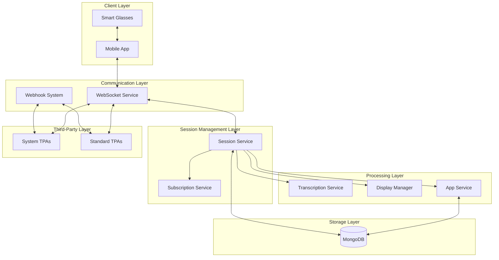
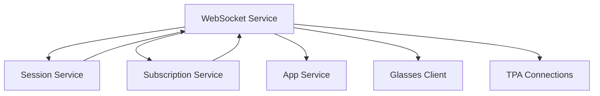
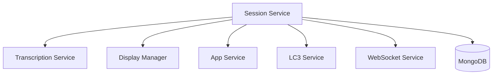
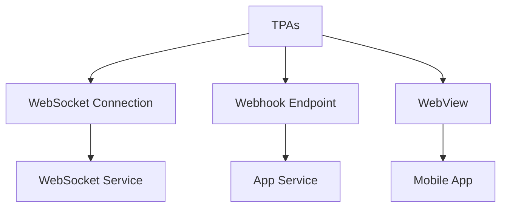
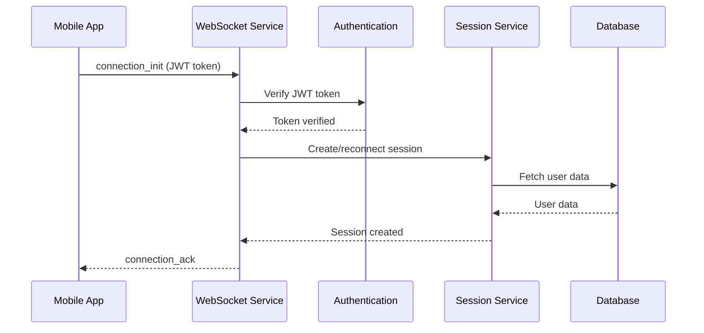
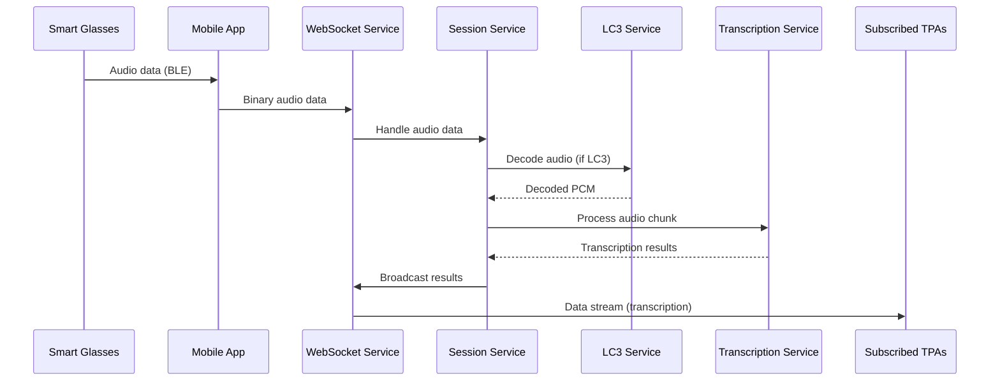
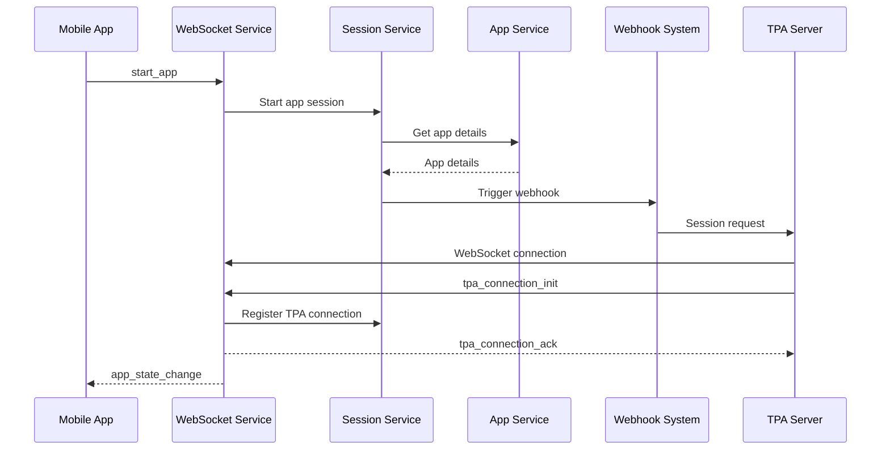

# System Integration Analysis

**Author:** Isaiah Ballah (github: isaiahb)  
**Date:** March 25, 2025  
**Version:** 1.0  

## 1. Introduction

This document provides a comprehensive analysis of how the different components of the AugmentOS Cloud system interact, focusing on integration points, dependencies, and potential issues. The goal is to identify existing or potential problems in the system's architecture and suggest improvements to enhance reliability, performance, and maintainability.

## 2. Core Component Interactions

### 2.1 High-Level System Flow



### 2.2 Data Flow Analysis

The data flows through the system in several key pathways:

1. **Audio Processing Path**:
   ```
   Glasses → Phone → WebSocketService → SessionService → TranscriptionService → WebSocketService → TPAs
   ```

2. **Display Request Path**:
   ```
   TPAs → WebSocketService → SessionService → DisplayManager → WebSocketService → Phone → Glasses
   ```

3. **Session Management Path**:
   ```
   Phone → WebSocketService → SessionService → AppService → WebhookSystem → TPAs
   ```

4. **Subscription Management Path**:
   ```
   TPAs → WebSocketService → SubscriptionService → SessionService
   ```

## 3. Component Dependencies and Integration Points

### 3.1 WebSocket Service Dependencies

The WebSocket Service is a central integration point with complex dependencies:



**Integration Issues**:
- **Circular Dependencies**: WebSocket Service and Session Service have a circular dependency, making changes to either component risky.
- **Responsibility Overlap**: Unclear boundaries between data routing (WebSocket) and subscription management.
- **Error Propagation**: Errors in Session Service can affect all WebSocket connections.

### 3.2 Session Service Dependencies

The Session Service manages user sessions and coordinates multiple components:



**Integration Issues**:
- **Central Point of Failure**: Session Service failure affects the entire system.
- **Memory Management**: User sessions can grow large with active connections and state.
- **State Synchronization**: Multiple services updating session state can lead to inconsistencies.

### 3.3 TPA Integration Points

TPAs integrate with the system through multiple channels:



**Integration Issues**:
- **Multiple Connection Paths**: TPAs interact through different channels, complicating error handling.
- **Stale References**: WebSocket connections stored in user sessions can become stale.
- **API Consistency**: Different integration points have inconsistent API patterns.

## 4. Critical System Paths and Failure Points

### 4.1 User Authentication Flow



**Failure Points**:
- **Token Verification**: Invalid or expired tokens cause authentication failures.
- **Database Access**: Database outages prevent session initialization.
- **Session Conflicts**: Multiple connections with same user ID can lead to race conditions.

### 4.2 Audio Processing Flow



**Failure Points**:
- **Audio Decoding**: LC3 decoding failures can disrupt transcription.
- **Transcription Service**: Errors in speech recognition affect all subscribed TPAs.
- **Broadcast Bottlenecks**: Large numbers of TPAs subscribed to audio can create performance issues.

### 4.3 TPA Startup Flow



**Failure Points**:
- **Webhook Delivery**: Webhook failures prevent TPA initialization.
- **TPA Server Availability**: Unavailable TPA servers cause startup failures.
- **Race Conditions**: Multiple start requests can lead to duplicate connections.

## 5. Identified System Issues

### 5.1 Session Management Issues

1. **Session State Inconsistency**:
   - **Problem**: The `userSession` object is modified by multiple services concurrently.
   - **Impact**: Race conditions can lead to inconsistent state.
   - **Root Cause**: No synchronization mechanism for shared session state.

2. **Memory Leaks in Session Management**:
   - **Problem**: Resources not properly cleaned up when sessions end.
   - **Impact**: Gradual resource exhaustion and performance degradation.
   - **Root Cause**: Incomplete cleanup in `endSession` method.

3. **Session ID Handling During Reconnection**:
   - **Problem**: Session ID changes during reconnection, but references in TPAs remain fixed.
   - **Impact**: TPA message routing failures after reconnection.
   - **Root Cause**: Session ID should be preserved or properly updated in all references.

### 5.2 WebSocket Service Issues

1. **Error Handling Deficiencies**:
   - **Problem**: WebSocket error handlers often log errors but don't recover gracefully.
   - **Impact**: Service disruptions on non-critical errors.
   - **Root Cause**: Lack of error categorization and recovery strategies.

2. **Message Routing Bottlenecks**:
   - **Problem**: All messages flow through a single WebSocket service.
   - **Impact**: High message volume can cause performance bottlenecks.
   - **Root Cause**: Monolithic architecture without message prioritization.

3. **Connection Pool Management**:
   - **Problem**: No limits on WebSocket connections per user or TPA.
   - **Impact**: Resource exhaustion with many connections.
   - **Root Cause**: Missing connection pool management and limits.

### 5.3 TPA Integration Issues

1. **Stale TPA Connection References**:
   - **Problem**: Session holds references to closed WebSocket connections.
   - **Impact**: Messages sent to disconnected TPAs, failures propagate to other components.
   - **Root Cause**: No validation of connection health before use.

2. **TPA Subscription State Loss**:
   - **Problem**: Subscription state is lost on TPA reconnection.
   - **Impact**: TPAs must re-subscribe to all streams after reconnection.
   - **Root Cause**: Subscription state not persisted outside the connection.

3. **Webhook Reliability Issues**:
   - **Problem**: No retry mechanism for failed webhook calls.
   - **Impact**: TPAs fail to initialize if webhook request fails.
   - **Root Cause**: Missing retry logic and fallback strategies.

### 5.4 Audio Processing Issues

1. **LC3 Decoder Stability**:
   - **Problem**: LC3 decoder initialization failures are not properly handled.
   - **Impact**: Audio processing chain breaks on decoder errors.
   - **Root Cause**: Insufficient error handling in audio processing pipeline.

2. **Audio Buffer Management**:
   - **Problem**: Audio buffering doesn't handle variable packet rates well.
   - **Impact**: Audio gaps or delays in high-latency scenarios.
   - **Root Cause**: Simple buffer design without adaptive timing.

3. **Transcription Stability**:
   - **Problem**: Transcription errors can disrupt the entire audio processing chain.
   - **Impact**: System-wide audio processing failures.
   - **Root Cause**: Transcription service failures affect all sessions.

## 6. Comprehensive Improvement Recommendations

### 6.1 Architecture Improvements

1. **Service Isolation and Resilience**:
   - Implement service boundaries with well-defined APIs
   - Use circuit breakers to prevent cascading failures
   - Add health checks for each service component

2. **Message Processing Architecture**:
   - Introduce message queue for asynchronous processing
   - Implement priority lanes for critical messages
   - Add message deduplication and idempotency

3. **State Management Redesign**:
   - Move state to persistent storage where appropriate
   - Implement optimistic concurrency for shared state
   - Add versioning to session state updates

### 6.2 Specific Component Improvements

#### WebSocket Service Improvements

1. **Connection Health Monitoring**:
   - Implement heartbeats for all WebSocket connections
   - Add connection timeout detection
   - Periodic connection health validation

2. **Error Recovery Mechanisms**:
   - Categorize errors (transient vs. permanent)
   - Implement recovery strategies by error type
   - Add graceful degradation paths

3. **Scalability Enhancements**:
   - Implement connection pooling
   - Add resource limits per user and TPA
   - Optimize broadcast patterns for high connection counts

#### Session Service Improvements

1. **State Consistency Mechanisms**:
   - Add mutex locks for critical state updates
   - Implement state snapshots and versioning
   - Conflict resolution for concurrent updates

2. **Resource Management**:
   - Implement resource tracking and limits
   - Add timeout-based resource cleanup
   - Proactive resource reclamation

3. **Session Recovery Enhancements**:
   - Preserve session IDs during reconnection
   - Improve session transfer with validation
   - Add session state persistence

#### TPA Integration Improvements

1. **Connection Validation System**:
   - Implement connection validation before use
   - Add proactive health checks
   - Dead connection pruning

2. **Subscription Persistence**:
   - Store subscription state outside connection
   - Automatic resubscription on reconnection
   - Subscription state versioning

3. **Webhook Reliability**:
   - Implement webhook retries with backoff
   - Add webhook failure recovery
   - Alternative initialization paths

### 6.3 Observability and Monitoring Improvements

1. **Enhanced Logging and Tracing**:
   - Implement distributed tracing (e.g., OpenTelemetry)
   - Add correlation IDs across components
   - Structured logging with context

2. **Performance Metrics Collection**:
   - Measure critical path latencies
   - Track resource usage by component
   - Monitor message throughput and queues

3. **Alerting and Automation**:
   - Set up alerts for critical failures
   - Implement automatic recovery for common issues
   - Add anomaly detection for system behavior

## 7. System Health Indicators

### 7.1 Key Health Metrics

| Metric | Healthy Range | Warning Range | Critical Range |
|--------|---------------|---------------|----------------|
| WebSocket Connection Success Rate | >99.5% | 95-99.5% | <95% |
| Session Initialization Time | <500ms | 500ms-1s | >1s |
| Transcription Latency | <300ms | 300-800ms | >800ms |
| TPA Webhook Success Rate | >99.9% | 95-99.9% | <95% |
| Message Processing Rate | >1000/s | 500-1000/s | <500/s |
| Active Session Count | <5000 | 5000-8000 | >8000 |

### 7.2 System Vitals Dashboard

Critical metrics to monitor on a system dashboard:

1. **Connection Health**:
   - Active WebSocket connections (glasses and TPAs)
   - Connection error rates
   - Connection duration distribution

2. **Processing Performance**:
   - Audio processing latency
   - Transcription queue length
   - Message broadcast times

3. **Resource Utilization**:
   - Memory usage per component
   - CPU utilization
   - Database connection pool utilization

4. **Error Rates**:
   - Authentication failures
   - WebSocket errors
   - TPA initialization failures

## 8. Implementation Priority Matrix

Prioritize improvements based on impact and effort:

| Improvement | Impact | Effort | Priority |
|-------------|--------|--------|----------|
| TPA Connection Validation | High | Low | P0 |
| WebSocket Heartbeats | High | Low | P0 |
| Session State Consistency | High | Medium | P1 |
| Error Recovery Mechanisms | High | Medium | P1 |
| Message Queue Architecture | Medium | High | P2 |
| Resource Management | Medium | Medium | P2 |
| Distributed Tracing | Medium | Medium | P2 |
| Webhook Retries | Medium | Low | P1 |
| LC3 Decoder Stability | High | Medium | P1 |
| Connection Pooling | Low | High | P3 |

## 9. Cross-Component Testing Scenarios

To validate system integration, implement the following test scenarios:

1. **Reconnection Cascade Test**:
   - Disconnect glasses client
   - Verify TPA connections remain active
   - Reconnect glasses client
   - Verify session state is properly restored
   - Check all TPAs receive appropriate notifications

2. **TPA Failure Recovery Test**:
   - Simulate TPA server failure during operation
   - Restart TPA server
   - Verify connection recovery
   - Check subscription state restoration

3. **Audio Processing Resilience Test**:
   - Inject malformed audio packets
   - Verify transcription service recovers
   - Check error doesn't propagate to other sessions

4. **High Load Session Test**:
   - Simulate many concurrent sessions
   - Verify system performance under load
   - Check resource utilization and cleanup

5. **Cascading Failure Test**:
   - Simulate database temporary outage
   - Verify system degrades gracefully
   - Check recovery when database returns

## 10. Conclusion

The AugmentOS Cloud system demonstrates a sophisticated architecture that enables real-time communication between smart glasses, mobile applications, and third-party applications. However, several integration issues need to be addressed to improve reliability, performance, and maintainability.

Key priorities for system improvement include:

1. Enhancing session management with better state consistency and validation
2. Implementing connection health monitoring for all WebSocket connections
3. Improving error handling and recovery mechanisms across components
4. Redesigning critical data flows for better resilience and performance

By addressing these integration issues, the system will provide a more stable and scalable platform for smart glasses applications, enhancing both developer and user experiences.