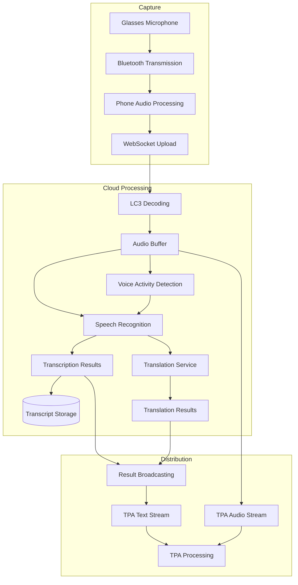
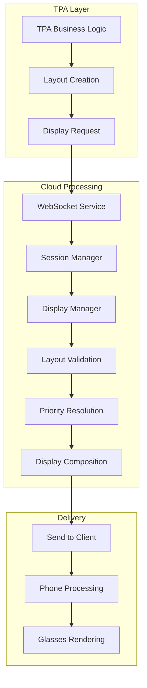
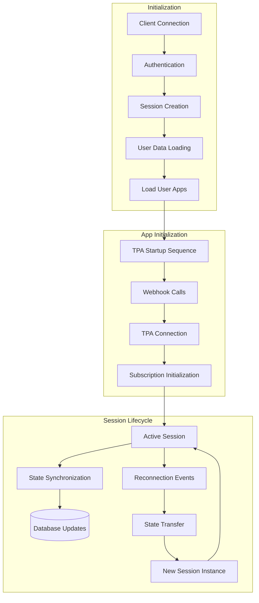
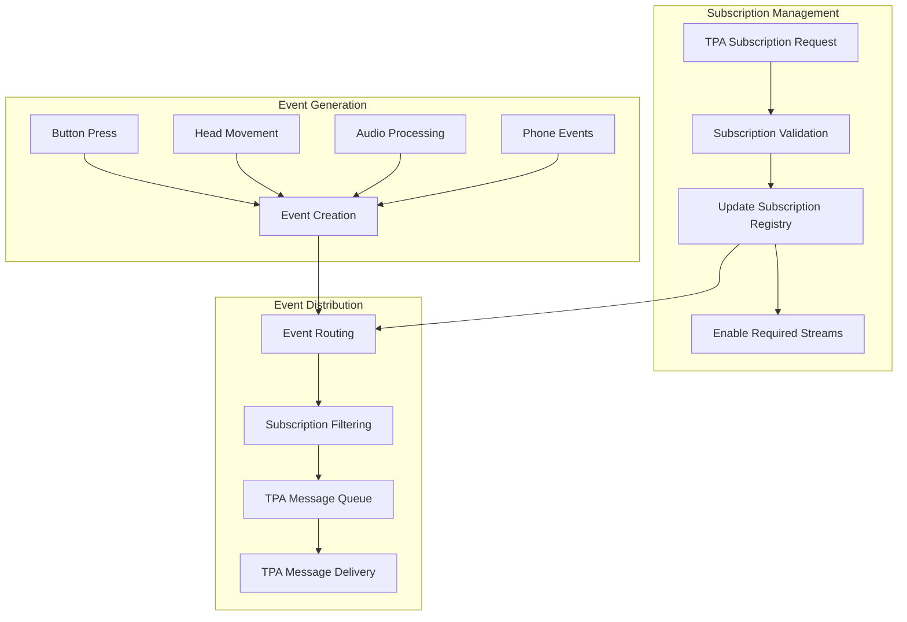
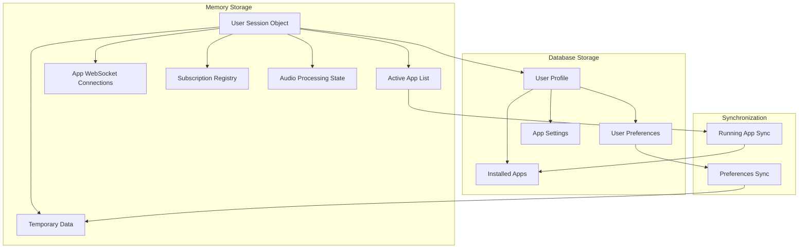
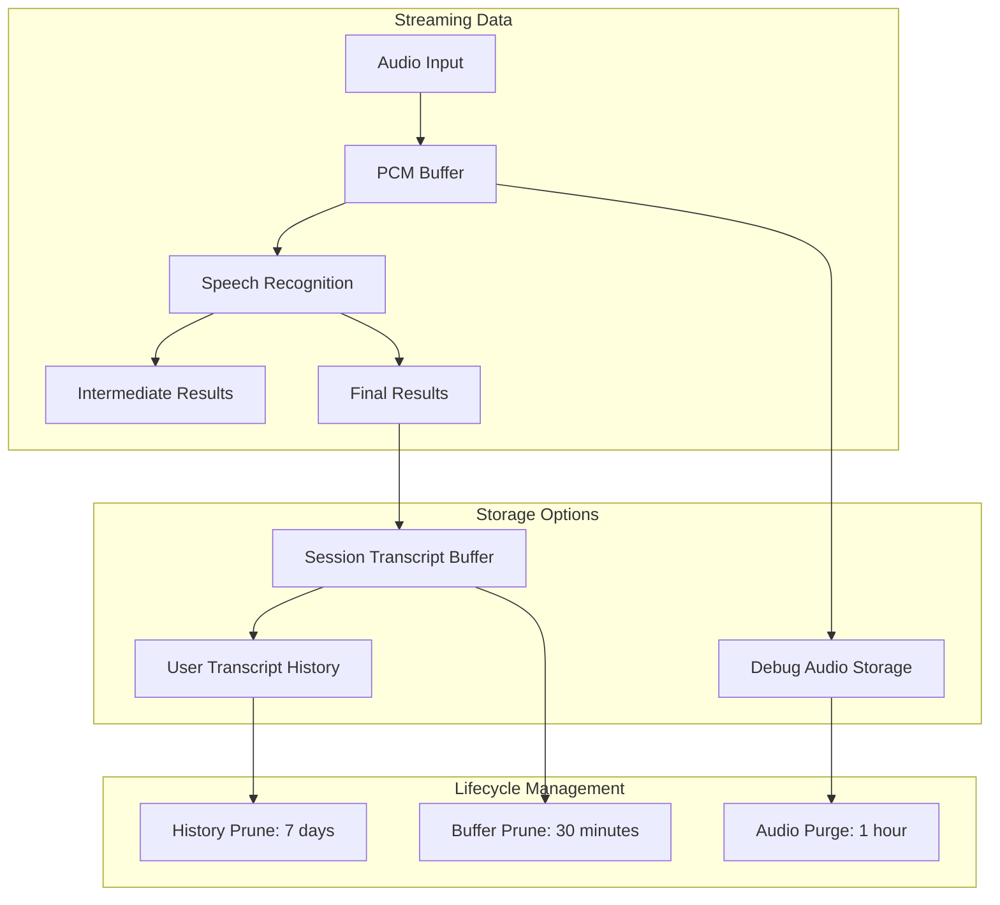
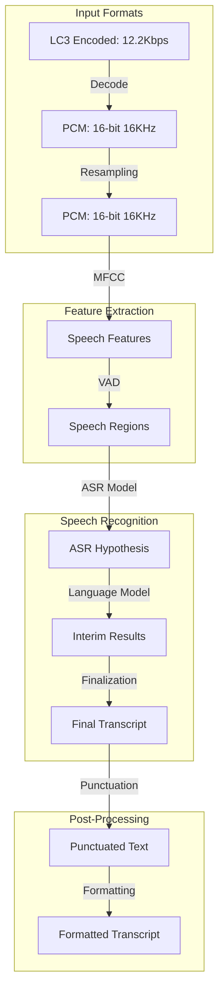
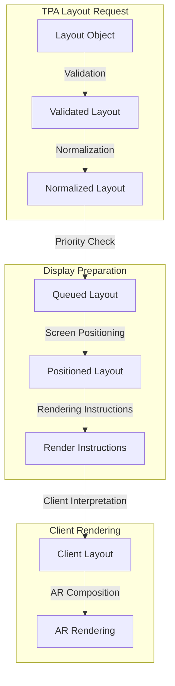

# Data Flow Analysis

**Author:** Isaiah Ballah (github: isaiahb)  
**Date:** March 25, 2025  
**Version:** 1.0  

## 1. Introduction

This document analyzes the data flows within the AugmentOS Cloud system, mapping how information moves between components, identifying bottlenecks, and providing recommendations for optimization. Understanding these data flows is crucial for debugging issues, optimizing performance, and planning system enhancements.

## 2. Primary Data Flows

### 2.1 Audio Data Flow

**Key Metrics**:
- Audio capture rate: 16kHz, 16-bit mono
- Audio packet size: ~4KB (250ms chunks)
- Typical audio latency: 150-250ms
- Transcription latency: 200-500ms
- Translation latency: 300-800ms

**Bottlenecks and Issues**:
1. **LC3 Decoding**: Single-threaded decoder can become a bottleneck during high CPU load
2. **Audio Buffer Management**: Fixed buffer size doesn't adapt to network conditions
3. **Transcription Service Capacity**: Limited concurrent sessions per transcription service instance
4. **Audio Broadcasting**: Inefficient for large numbers of TPAs receiving raw audio

### 2.2 Display Request Flow

**Key Metrics**:
- Display request size: 0.5-5KB
- Request-to-display latency: 100-300ms
- Maximum requests per second: ~50 per session
- Typical display duration: 3-10 seconds

**Bottlenecks and Issues**:
1. **Priority Resolution**: Display conflicts can cause processing delays
2. **Layout Validation**: Complex layouts require more validation time
3. **Display Composition**: Inefficient for rapid updates
4. **Request Rate Limiting**: Insufficient throttling for high-frequency updates

### 2.3 Session Management Flow

**Key Metrics**:
- Session initialization time: 500-1500ms
- TPA startup time: 200-1000ms per TPA
- Session data size: 10-100KB
- Maximum active TPAs per session: ~20
- Reconnection frequency: ~10-20 per day per active user

**Bottlenecks and Issues**:
1. **App Loading**: Sequential loading increases initialization time
2. **Webhook Execution**: Network delays affect TPA startup time
3. **State Transfer**: Large sessions take longer to transfer during reconnection
4. **Database Updates**: Frequent small updates create database load

### 2.4 Subscription and Event Flow

**Key Metrics**:
- Subscription update size: 0.2-1KB
- Event generation rate: 1-100 events/second
- Event size: 0.1-5KB
- Subscription count: 5-30 per TPA
- Event delivery latency: 50-200ms

**Bottlenecks and Issues**:
1. **Subscription Validation**: Language-specific subscriptions require extra processing
2. **Event Routing**: All events flow through central router creating potential bottleneck
3. **Subscription Filtering**: Linear search in some cases
4. **TPA Message Delivery**: No prioritization for important events

## 3. Data Storage Patterns

### 3.1 Session State Storage

**Storage Patterns**:
- In-memory session: 100KB-5MB per user
- Database storage: 5-50KB per user
- Session persistence: Selected fields only
- Sync frequency: On change, batched every 5 seconds

**Issues and Concerns**:
1. **Memory Consumption**: Large sessions for power users
2. **Partial Persistence**: Not all state can be recovered from database
3. **Sync Consistency**: Race conditions during rapid changes
4. **Connection Storage**: WebSocket objects not serializable

### 3.2 Transcript and Audio Storage

**Storage Patterns**:
- Audio debug storage: Optional, up to 10MB per session
- Transcript buffer: 10-100KB per session
- User history: Up to 1MB per user
- Storage format: Raw JSON for transcripts, WAV for debug audio

**Issues and Concerns**:
1. **Debug Storage Growth**: Unbounded growth in development environments
2. **Privacy Considerations**: Audio data requires special handling
3. **Pruning Efficiency**: Pruning large buffers can impact performance
4. **Format Consistency**: Inconsistent timestamp formats between components

## 4. Data Transformation Points

### 4.1 Audio Processing Pipeline

**Transformation Issues**:
1. **Codec Compatibility**: LC3 decoder occasionally fails with certain packet patterns
2. **Resampling Quality**: Simple resampling affects recognition accuracy
3. **VAD Sensitivity**: Too sensitive in noisy environments
4. **ASR Adaptation**: Limited speaker adaptation for accents

### 4.2 Display Layout Transformation

**Transformation Issues**:
1. **Layout Normalization**: Inconsistent handling of optional fields
2. **Text Wrapping**: Layout engine and client may wrap text differently
3. **Screen Positioning**: Coordinates not adjusted for different glasses models
4. **Priority Resolution**: Multiple layouts can conflict in unexpected ways

## 5. Performance Analysis

### 5.1 Latency Breakdown

| Flow Path | Component | Average Latency | P95 Latency | Bottleneck Potential |
|-----------|-----------|-----------------|------------|---------------------|
| Audio | Bluetooth Transmission | 60ms | 120ms | Medium |
| Audio | WebSocket Upload | 40ms | 90ms | Medium |
| Audio | LC3 Decoding | 15ms | 30ms | Low |
| Audio | Speech Recognition | 150ms | 350ms | High |
| Audio | Translation | 200ms | 500ms | High |
| Audio | Broadcasting to TPAs | 30ms | 80ms | Medium |
| Display | Display Request Creation | 10ms | 25ms | Low |
| Display | Priority Resolution | 20ms | 50ms | Medium |
| Display | Display Composition | 15ms | 40ms | Low |
| Display | Delivery to Glasses | 70ms | 150ms | High |
| Session | Authentication | 50ms | 120ms | Medium |
| Session | Database Queries | 80ms | 200ms | High |
| Session | TPA Webhook Calls | 100ms | 300ms | High |
| Event | Event Generation | 5ms | 15ms | Low |
| Event | Subscription Filtering | 10ms | 30ms | Low |
| Event | TPA Delivery | 35ms | 80ms | Medium |

### 5.2 Throughput Limitations

| Component | Current Throughput | Maximum Throughput | Scaling Factor |
|-----------|-------------------|-------------------|---------------|
| WebSocket Service | 5,000 connections | 15,000 connections | CPU, Memory |
| Transcription Service | 200 concurrent sessions | 500 concurrent sessions | CPU, API limits |
| Database | 1,000 ops/second | 5,000 ops/second | Disk I/O, Connection Pool |
| TPA Webhook System | 50 calls/second | 200 calls/second | Network, Remote Capacity |
| Event Distribution | 10,000 events/second | 50,000 events/second | CPU, Memory |

### 5.3 Resource Utilization

| Component | CPU Usage | Memory Usage | Network Usage | Scaling Bottleneck |
|-----------|-----------|--------------|--------------|-------------------|
| WebSocket Service | 30-40% | 2-4GB | 50-100Mbps | Memory |
| Session Service | 20-30% | 4-8GB | 10-20Mbps | Memory |
| Transcription Service | 50-70% | 1-2GB | 5-10Mbps | CPU |
| App Service | 10-20% | 1-2GB | 5-10Mbps | None |
| Database | 20-30% | 2-4GB | 10-20Mbps | Disk I/O |

## 6. Data Security and Privacy

### 6.1 Data Classification

| Data Type | Classification | Retention Period | Encryption | Access Control |
|-----------|---------------|------------------|------------|---------------|
| User Authentication | Sensitive | Session only | In-transit | Authentication Service |
| Audio Recordings | Very Sensitive | Debug only (1h) | In-transit, At-rest | System Admin only |
| Transcriptions | Sensitive | 7 days | In-transit | User, Authorized TPAs |
| User Preferences | Standard | Persistent | In-transit | User, System Services |
| Session State | Standard | Session only | In-transit | System Services |
| TPA Settings | Standard | Persistent | In-transit | User, Specific TPA |

### 6.2 Data Flow Security Risks

1. **Audio Data Exposure**:
   - Risk: Debug audio storage accessible to unauthorized parties
   - Mitigation: Strict access controls, encryption, automatic purging

2. **Session Token Handling**:
   - Risk: Session tokens in WebSocket messages
   - Mitigation: Short token lifetime, secure storage, TLS for all connections

3. **TPA Data Access**:
   - Risk: TPAs accessing unauthorized data streams
   - Mitigation: Strict subscription validation, fine-grained permissions

4. **Transcript Privacy**:
   - Risk: Sensitive information in transcripts
   - Mitigation: Limited retention, user controls for transcript access

## 7. Optimization Recommendations

### 7.1 Audio Flow Optimization

1. **Parallel LC3 Decoding**:
   - Implement thread pool for LC3 decoding
   - Estimate 30-40% latency reduction for decoding
   - Priority: Medium

2. **Adaptive Audio Buffering**:
   - Dynamically adjust buffer size based on network conditions
   - Estimate 40-60% jitter reduction
   - Priority: High

3. **Optimized Broadcast Patterns**:
   - Implement binary message fanout for audio data
   - Estimate 50-70% reduction in broadcast CPU usage
   - Priority: Medium

4. **Transcription Service Scaling**:
   - Add horizontal scaling for transcription workers
   - Estimate 2-3x capacity increase
   - Priority: High

### 7.2 Display Flow Optimization

1. **Layout Caching**:
   - Cache normalized layouts for repeated displays
   - Estimate 40-50% CPU reduction for frequent layouts
   - Priority: Medium

2. **Priority Precomputation**:
   - Precompute layout priorities upon connection
   - Estimate 30-40% latency reduction for priority resolution
   - Priority: Low

3. **Display Batching**:
   - Batch display updates within 20ms windows
   - Estimate 30-50% reduction in display update messages
   - Priority: Medium

4. **Progressive Layout Rendering**:
   - Send layout skeleton first, then details
   - Estimate 40-60% perceived latency reduction
   - Priority: High

### 7.3 Session Management Optimization

1. **Parallel TPA Initialization**:
   - Initialize TPAs concurrently rather than sequentially
   - Estimate 40-60% reduction in session initialization time
   - Priority: High

2. **Session State Partitioning**:
   - Split session state into hot/cold parts
   - Estimate 30-40% memory usage reduction
   - Priority: Medium

3. **Optimistic Reconnection**:
   - Begin session transfer before full validation
   - Estimate 40-50% reduction in reconnection time
   - Priority: High

4. **Database Access Optimization**:
   - Batch database updates and reads
   - Estimate 60-70% reduction in database operations
   - Priority: Medium

### 7.4 Subscription System Optimization

1. **Subscription Index**:
   - Replace linear search with indexed lookup
   - Estimate 70-80% reduction in subscription lookup time
   - Priority: Medium

2. **Event Prefiltering**:
   - Filter events before entering main event queue
   - Estimate 40-50% reduction in event processing load
   - Priority: Medium

3. **Prioritized Event Delivery**:
   - Implement message priority for critical events
   - Estimate 60-70% reduction in critical event latency
   - Priority: High

4. **Subscription Compaction**:
   - Optimize storage of similar subscriptions
   - Estimate 30-40% memory reduction for subscription storage
   - Priority: Low

## 8. Implementation Roadmap

### 8.1 Quick Wins (1-2 Weeks)

1. **Parallel TPA Initialization**:
   - Highest impact/effort ratio
   - Immediate user experience improvement
   - No architectural changes needed

2. **Adaptive Audio Buffering**:
   - Significant quality improvement
   - Localized changes to session service
   - Simple configuration parameters

3. **Prioritized Event Delivery**:
   - Critical feature for reliability
   - Moderate implementation complexity
   - Significant user experience impact

### 8.2 Medium-Term Improvements (1-2 Months)

1. **Optimized Broadcast Patterns**:
   - Significant performance improvement
   - Requires WebSocket service changes
   - Testing for correctness needed

2. **Session State Partitioning**:
   - Scalability improvement
   - Database schema changes required
   - Careful migration planning needed

3. **Progressive Layout Rendering**:
   - User experience enhancement
   - Requires client and server changes
   - Careful testing across devices

### 8.3 Long-Term Enhancements (3+ Months)

1. **Transcription Service Scaling**:
   - Major architecture improvement
   - Infrastructure changes required
   - Gradual rollout strategy needed

2. **Database Access Optimization**:
   - System-wide improvement
   - Multiple component changes
   - Careful performance testing required

3. **Subscription System Redesign**:
   - Foundational architecture improvement
   - API changes may affect TPAs
   - Comprehensive testing required

## 9. Monitoring and Metrics

### 9.1 Key Performance Indicators

| Flow | KPI | Target | Warning Threshold | Critical Threshold |
|------|-----|--------|-------------------|-------------------|
| Audio | End-to-End Latency | <400ms | 400-800ms | >800ms |
| Audio | Transcription Accuracy | >92% | 85-92% | <85% |
| Display | Request-to-Render Time | <200ms | 200-500ms | >500ms |
| Session | Initialization Time | <1.5s | 1.5-3s | >3s |
| Session | Reconnection Success Rate | >98% | 95-98% | <95% |
| Event | Event Delivery Success Rate | >99.9% | 99-99.9% | <99% |
| Event | Critical Event Latency | <100ms | 100-250ms | >250ms |

### 9.2 Recommended Monitoring Points

1. **End-to-End Flow Monitoring**:
   - Audio capture to transcription delivery
   - Display request to glasses rendering
   - Session creation to TPA initialization

2. **Component Health Metrics**:
   - WebSocket connection counts and error rates
   - Transcription service queue depths
   - Database operation latencies
   - TPA webhook success rates

3. **Resource Utilization Metrics**:
   - Memory usage per service
   - CPU utilization per component
   - Network bandwidth per connection
   - Storage growth rates

### 9.3 Alerting Recommendations

1. **User Impact Alerts**:
   - Session initialization failures > 5%
   - Transcription failures > 2%
   - Display rendering failures > 1%

2. **System Health Alerts**:
   - Any component CPU > 80% for 5 minutes
   - Any component memory > 90% for 5 minutes
   - Database latency > 100ms for 1 minute
   - WebSocket error rate > 5% for 1 minute

3. **Capacity Planning Alerts**:
   - 80% of maximum concurrent sessions
   - 80% of maximum WebSocket connections
   - 80% of maximum database connections
   - 80% of maximum transcription capacity

## 10. Conclusion

The AugmentOS Cloud data flows reveal a sophisticated but complex system with several opportunities for optimization. By focusing on the highest-impact improvements first, particularly in audio processing, session initialization, and event delivery, the system can achieve significant performance and reliability gains.

Key priorities should include:

1. Parallel TPA initialization to reduce session startup time
2. Adaptive audio buffering to improve transcription quality
3. Prioritized event delivery for critical system messages
4. Optimized broadcast patterns for efficient message distribution

These improvements will enhance both the developer and end-user experience while providing a foundation for long-term system scalability. Regular monitoring of the recommended KPIs will help track progress and identify emerging issues before they impact users.