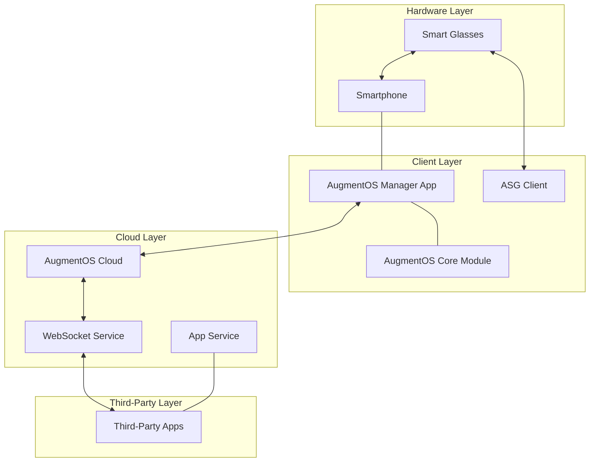

# Contributing to AugmentOS

Thank you for your interest in contributing to AugmentOS! This guide will help you understand the project architecture, development workflow, and how to make effective contributions.

## Project Overview

AugmentOS is an open-source operating system, app store, and development framework for smart glasses. The system follows a distributed architecture where most processing happens in the cloud, with the glasses primarily acting as input/output devices.

### Core Components



### System Components

1. **AugmentOS Manager** (`augmentos_manager/`): 
   - React Native application for smartphones
   - User interface for managing glasses, apps, and settings
   - Interfaces with native modules on iOS/Android

2. **AugmentOS Core** (`augmentos_core/`):
   - Android native module
   - Handles Bluetooth communication with glasses
   - Manages glass connections and capabilities

3. **ASG Client** (`augmentos_asg_client/`):
   - Android app for Android-based smart glasses
   - Enables glasses to connect to the AugmentOS ecosystem
   - Provides audio/visual input/output

4. **AugmentOS Cloud** (`augmentos_cloud/`):
   - Node.js backend services
   - Manages app sessions, transcription, and display
   - Handles real-time communication between glasses and TPAs
   - Controls app lifecycle and display rendering

5. **Third-Party Apps**:
   - External web servers that connect to AugmentOS cloud
   - Use webhooks and websockets for real-time communication
   - Leverage AugmentOS SDK for display and input handling

## Data Flow


## Third-Party App Architecture

Third-party apps in the AugmentOS ecosystem follow a specific pattern:

1. **Webhook Endpoint** - Entry point for starting an app session
2. **WebSocket Connection** - Real-time communication channel
3. **Event Subscriptions** - Listen for specific user events
4. **Display Requests** - Send content to be displayed on glasses

## Development Environment Setup

### Prerequisites

- Node.js and npm/yarn/bun
- Android Studio (for Android development)
- Xcode (for iOS development)
- Docker and Docker Compose (for cloud development)

### Setting Up the Manager App

```bash
# Clone the repository
git clone https://github.com/AugmentOS-Community/AugmentOS.git
cd AugmentOS/augmentos_manager

# Install dependencies
npm install

# For iOS
cd ios && pod install && cd ..

# Start the development server
npm start

# Run on Android/iOS
npm run android
# or
npm run ios
```

### Setting Up the Cloud Backend

```bash
cd AugmentOS/augmentos_cloud

# Install dependencies
bun install

# Setup Docker network
bun run dev:setup-network

# Start development environment
./scripts/docker-setup.sh
# or
bun run setup-deps
bun run dev
```

## Contribution Workflow

1. **Fork the Repository**: Create your own fork of the AugmentOS repository.
2. **Create a Branch**: Make your changes in a new branch.
3. **Develop and Test**: Make your changes and test thoroughly.
4. **Submit a Pull Request**: Create a PR with a clear description of your changes.

## Coding Standards and Guidelines

### Naming Conventions

- Top-level folders follow the pattern: `augmentos_${component}`
- User-facing names use CamelCase: "AugmentOS App", "AugmentOS Store", "AugmentOS Manager"
- Code follows language-specific conventions (Java, TypeScript, Swift, etc.)

### Code Style

- For TypeScript/JavaScript: Follow ESLint configurations
- For Java: Follow Android code style guidelines
- For Swift: Follow Swift style guide

## Documentation

- Update relevant documentation when adding new features
- Include code comments for complex logic
- Create or update API documentation as needed

## Testing

- Write unit tests for new features
- Ensure your changes pass existing tests
- Test on actual devices when possible

## Communication

- Join our [Discord community](https://discord.gg/5ukNvkEAqT)
- Report issues on GitHub
- Discuss major changes in advance

## Where to Start

### Good First Issues

- Documentation improvements
- Bug fixes
- UI enhancements
- Test improvements

### Key Areas for Contribution

1. **Display Rendering**: Improve UI components and layouts
2. **Glasses Support**: Add support for new smart glasses models
3. **SDK Enhancements**: Improve developer experience
4. **Performance Optimization**: Reduce latency and improve efficiency

## License

By contributing to AugmentOS, you agree that your contributions will be licensed under the project's license terms.